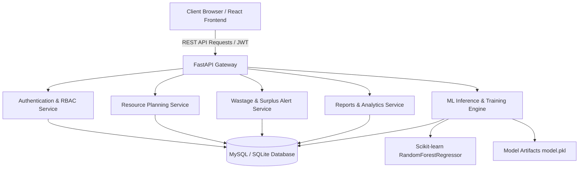

# PredictIQ System Architecture

## 1. System Overview
PredictIQ is a cloud-ready AI-driven Food Demand Forecasting and Resource Planning System engineered to mitigate institutional food wastage, streamline kitchen inventory procurement, and automate surplus food donation routing.

---

## 2. Core Subsystems

### A. Machine Learning Pipeline (`ml/`)
- **Algorithm**: `RandomForestRegressor(n_estimators=120, max_depth=12, random_state=42)`
- **Preprocessing**: `ColumnTransformer` with `OneHotEncoder(handle_unknown='ignore')` for categorical dimensions (`Food_Category`, `Day_of_Week`, `Holiday`, `Special_Event`, `Weather`) and `StandardScaler` for `Expected_Customers`.
- **Target Variable**: `Food_Consumed` (Actual meals consumed by patrons).
- **Inference Metric Computations**:
  - `Predicted Demand` = $\hat{y}$
  - `Recommended Preparation` = $\hat{y} \times (1 + \text{Safety Buffer})$ (typically 5%–8%)
  - `Surplus Risk` triggered if planned production $> \text{Recommended} + 25\text{ meals}$.

### B. Dynamic Resource & Recipe Engine
- Maps each food category to configurable ingredient formulas:
  $$\text{Required Quantity} = \text{Recommended Prep} \times \text{Quantity per Unit}$$
  $$\text{Procurement Shortage} = \max(0, \text{Required Quantity} - \text{Current Stock})$$
  $$\text{Estimated Line Cost} = \text{Required Quantity} \times \text{Cost per Unit}$$

### C. Role-Based Access Control (RBAC)
- **Admin**: Complete system control, user management, ML model retraining, dataset ingestion, and recipe management.
- **Staff**: Daily food record logging, running demand predictions, viewing dashboard KPIs, and checking donation alerts.

---

## 3. Database Architecture
| Table Name | Primary Responsibility |
|:---|:---|
| `users` | User credentials, roles (`Admin`, `Staff`), password hashes (`bcrypt`) |
| `food_records` | Historical log of prepared, consumed, leftover, and weather factors |
| `predictions` | Historical ML demand predictions and recommended buffers |
| `resources` | Configurable recipe formulas, units, inventory, and unit costs |
| `resource_plans` | Itemized ingredient shortages and cost breakdowns per prediction |
| `model_metrics` | Machine learning evaluation tracking ($R^2$, MAE, RMSE) |
| `alerts` | Actionable surplus food warnings and donation queue items |
| `dataset_logs` | Audit trail for batch CSV and Excel uploads |
